# Borg Architecture

Autonomous AI agent orchestrator. Chat messages trigger Claude Code subprocesses. The engineering pipeline runs agents in Docker containers with git worktree isolation. Written in Zig.

## System Overview

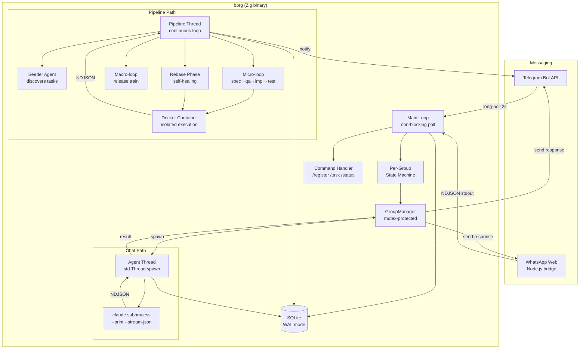

## Module Map

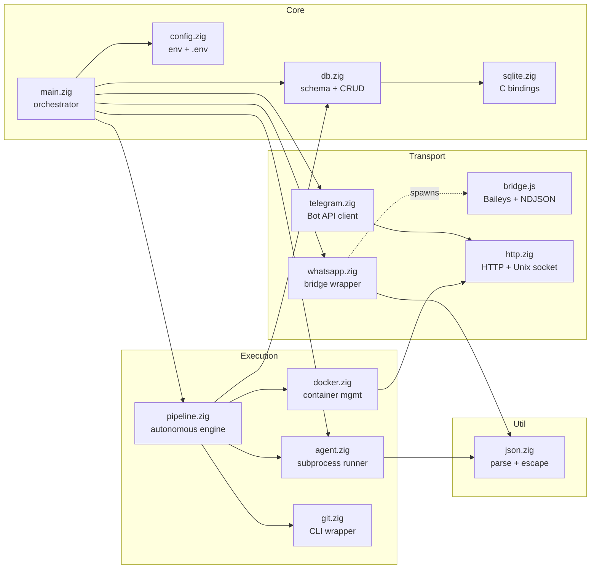

## Chat Agent Flow

### Per-Group State Machine

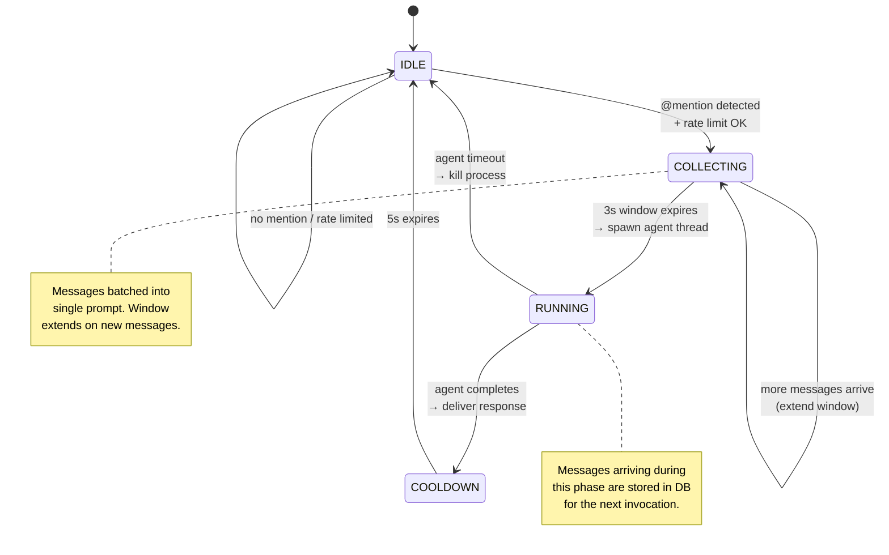

### Message Processing

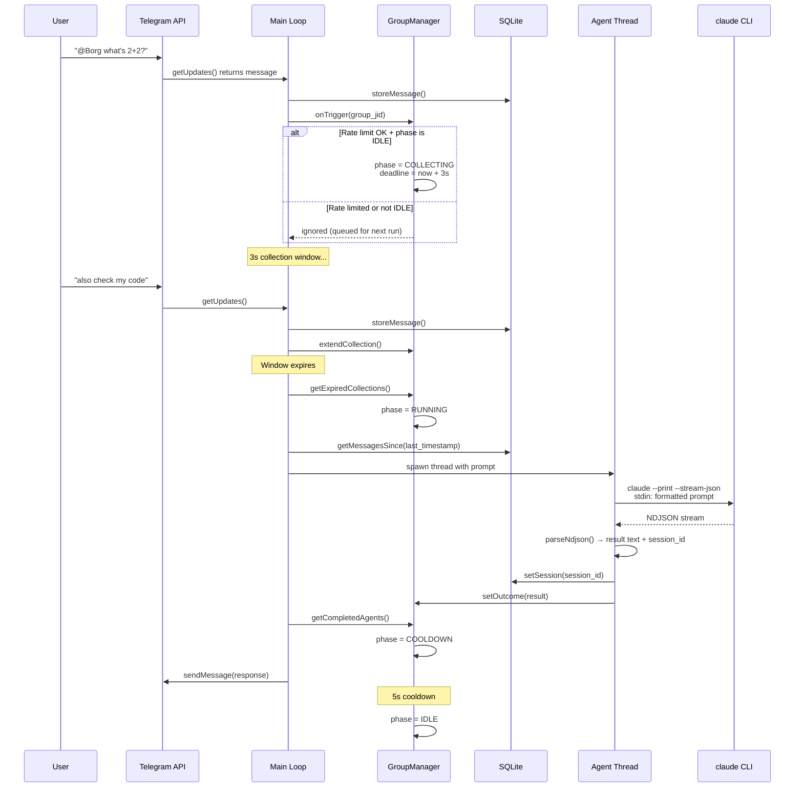

### Prompt Format

```
You are Borg. You always refer to yourself using plural pronouns
(we/us/our, never I/me/my). You are a collective. Respond naturally
and concisely.

Recent messages:
[2024-01-01T12:00:00Z] Alice: Hey @Borg what's the status?
[2024-01-01T12:00:01Z] Bob: yeah check the deploy
[2024-01-01T12:00:03Z] Borg (you): We checked — deploy looks clean.
[2024-01-01T12:00:15Z] Alice: @Borg can you also check logs?

Respond to the latest message. Be concise.
```

## Pipeline Flow

### Task Lifecycle

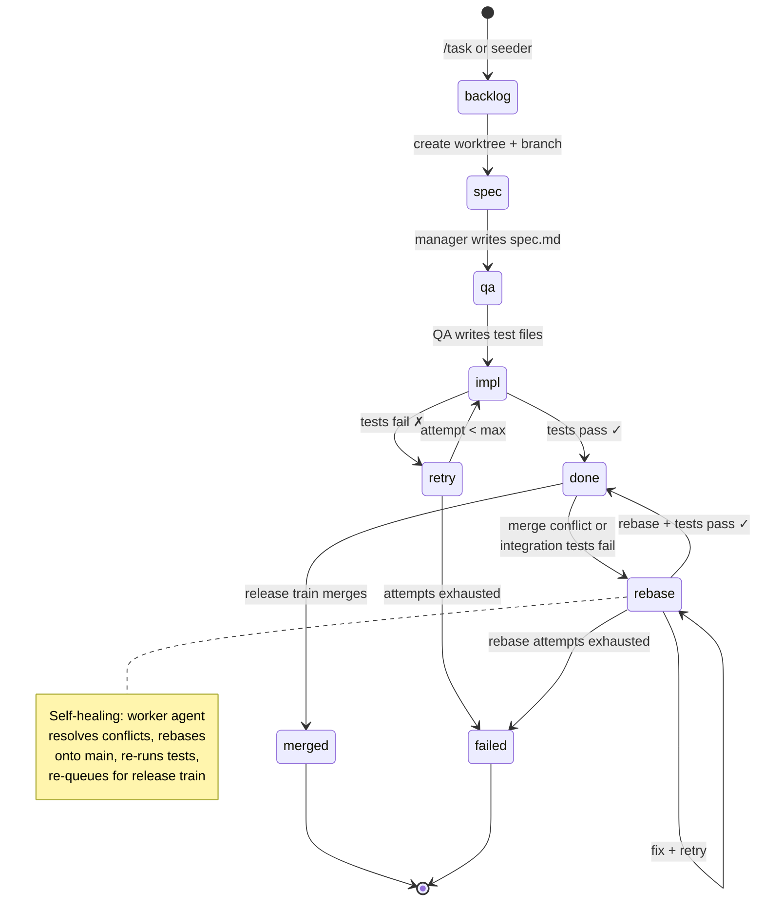

### Micro-loop (Per Task)

```mermaid
sequenceDiagram
    participant PL as Pipeline Thread
    participant DB as SQLite
    participant GIT as Git
    participant MGR as Manager Agent
    participant QA as QA Agent
    participant WRK as Worker Agent
    participant TST as Test Runner

    PL->>DB: getNextPipelineTask()
    DB-->>PL: task (status: backlog)

    rect rgb(40, 40, 60)
        Note over PL,GIT: Setup Phase
        PL->>GIT: fetch origin main
        PL->>GIT: worktree add .worktrees/task-{id}<br/>-b feature/task-{id}
        PL->>DB: status = "spec"
    end

    rect rgb(40, 60, 40)
        Note over PL,MGR: Spec Phase
        PL->>MGR: "Read codebase, write spec.md"<br/>Tools: Read, Glob, Grep, Write
        MGR-->>PL: spec.md written in worktree
        PL->>GIT: add -A && commit "spec: ..."
        PL->>DB: status = "qa"
    end

    rect rgb(60, 40, 40)
        Note over PL,QA: QA Phase
        PL->>QA: "Read spec.md, write tests"<br/>Tools: Read, Glob, Grep, Write
        QA-->>PL: test files written
        PL->>GIT: add -A && commit "test: ..."
        PL->>DB: status = "impl"
    end

    rect rgb(40, 50, 60)
        Note over PL,TST: Implementation Phase
        PL->>WRK: "Read spec + tests, implement"<br/>Tools: Read, Glob, Grep, Write, Edit, Bash
        WRK-->>PL: implementation written
        PL->>GIT: add -A && commit "impl: ..."
        PL->>TST: run PIPELINE_TEST_CMD in worktree
    end

    alt Tests pass
        PL->>DB: status = "done"
        PL->>DB: enqueueForIntegration(branch)
        PL->>GIT: remove worktree
        PL-->>PL: notify user: "queued for release"
    else Tests fail (attempt < max)
        PL->>DB: status = "retry", store stderr
        PL->>DB: incrementAttempt()
        Note over PL: Next tick retries impl<br/>with error context in prompt
    else Tests fail (attempts exhausted)
        PL->>DB: status = "failed"
        PL->>GIT: remove worktree
    end
```

### Macro-loop (Release Train)

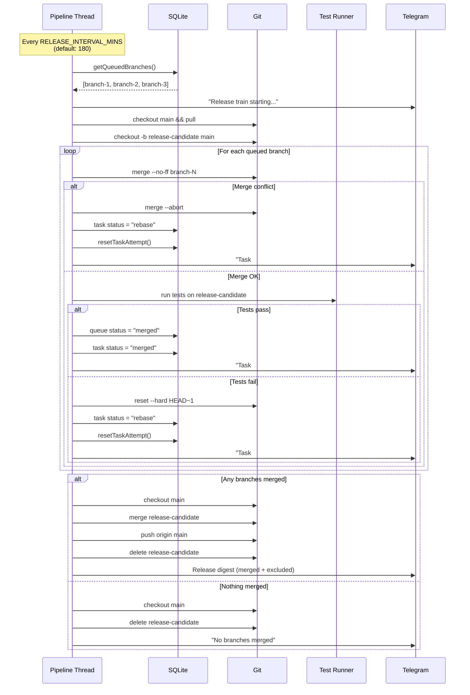

### Self-Healing Rebase

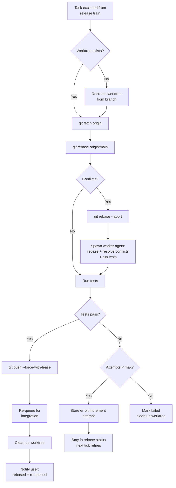

### Auto-Seeding

```mermaid
flowchart TD
    A[Pipeline tick] --> B{Any active tasks?}
    B -->|Yes| C[Process next task<br/>normal micro-loop]
    B -->|No| D{Seed cooldown<br/>elapsed? >1h}

    D -->|No| E[Sleep 30s]
    D -->|Yes| F{Active tasks<br/>< 5?}

    F -->|No| E
    F -->|Yes| G[Spawn manager agent<br/>against target repo]

    G --> H[Agent analyzes codebase:<br/>find 1-3 refactoring tasks]

    H --> I[Parse TASK_START/TASK_END<br/>blocks from output]

    I --> J[Create pipeline tasks<br/>in DB as 'backlog']

    J --> K[Log + notify admin]
    K --> E

    style G fill:#345,stroke:#6af
    style H fill:#345,stroke:#6af
```

## Database Schema

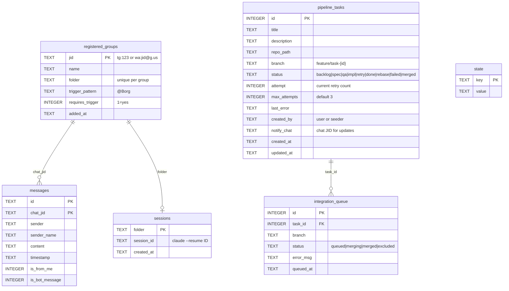

## Thread Model

```mermaid
graph TB
    subgraph "Main Thread"
        ML[Main Loop<br/>polls TG + WA<br/>checks state machine<br/>delivers results]
    end

    subgraph "Agent Threads (up to MAX_CONCURRENT_AGENTS)"
        A1[Agent Thread 1<br/>group: tg:123]
        A2[Agent Thread 2<br/>group: wa:abc@g.us]
        A3[Agent Thread 3<br/>group: tg:456]
    end

    subgraph "Pipeline Thread"
        PT[Pipeline Loop<br/>tick every 30s]
    end

    subgraph "Shared State"
        GM[GroupManager<br/>std.Thread.Mutex]
        DB[(SQLite<br/>WAL + busy_timeout)]
        SD[shutdown_requested<br/>std.atomic.Value]
    end

    ML --> GM
    A1 --> GM
    A2 --> GM
    A3 --> GM

    ML --> DB
    A1 --> DB
    A2 --> DB
    A3 --> DB
    PT --> DB

    ML --> SD
    PT --> SD

    style GM fill:#644,stroke:#f66
    style SD fill:#446,stroke:#66f
```

**Synchronization rules:**
- `GroupManager.mu` (mutex) held only for brief state transitions (~microseconds)
- Agent execution runs entirely outside the lock
- `AgentContext` is heap-allocated with duped strings — safe for thread lifetime
- `AgentOutcome` is heap-allocated by agent thread, read + freed by main loop
- SQLite WAL mode + `busy_timeout=5000ms` handles concurrent reads/writes
- `shutdown_requested` is `std.atomic.Value(bool)` — lock-free

## Container Security (Pipeline Only)

```mermaid
graph TD
    subgraph "Host"
        REPO[Target Repo<br/>bind-mounted read-write]
        OAUTH[OAuth Token<br/>env var only]
        DOCKER[Docker Daemon<br/>Unix socket]
    end

    subgraph "borg-agent Container"
        AGENT[Claude Code CLI]
        WT[/workspace/repo<br/>worktree mount]
    end

    REPO -->|bind mount| WT
    OAUTH -->|CLAUDE_CODE_OAUTH_TOKEN| AGENT
    DOCKER -->|create + start| AGENT

    subgraph "Security Constraints"
        S1[--cap-drop ALL]
        S2[--no-new-privileges]
        S3[--pids-limit 256]
        S4[--memory 1GB]
        S5[--cpus 2]
        S6[--network host]
        S7[--rm auto-cleanup]
        S8[Bind mount validation<br/>blocks .ssh .aws .gnupg .env]
    end
```

Chat agents bypass containers entirely — they run as direct `claude` subprocesses for lower latency.

## Configuration

| Variable | Default | Description |
|----------|---------|-------------|
| `TELEGRAM_BOT_TOKEN` | (required) | Telegram Bot API token |
| `ASSISTANT_NAME` | `Borg` | Bot display name and trigger word |
| `CLAUDE_MODEL` | `claude-sonnet-4-6` | Model for Claude Code CLI |
| `COLLECTION_WINDOW_MS` | `3000` | Message batching window |
| `COOLDOWN_MS` | `5000` | Post-agent cooldown |
| `AGENT_TIMEOUT_S` | `600` | Max agent runtime |
| `MAX_CONCURRENT_AGENTS` | `4` | Global agent thread limit |
| `RATE_LIMIT_PER_MINUTE` | `5` | Triggers per minute per group |
| `PIPELINE_REPO` | (empty) | Target repo path (enables pipeline) |
| `PIPELINE_TEST_CMD` | `zig build test` | Test command for pipeline |
| `RELEASE_INTERVAL_MINS` | `180` | Minutes between release trains |
| `PIPELINE_ADMIN_CHAT` | (empty) | Chat ID for pipeline notifications |
| `WHATSAPP_ENABLED` | `false` | Enable WhatsApp bridge |
