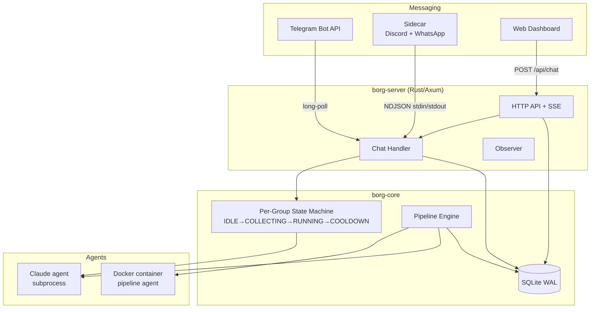
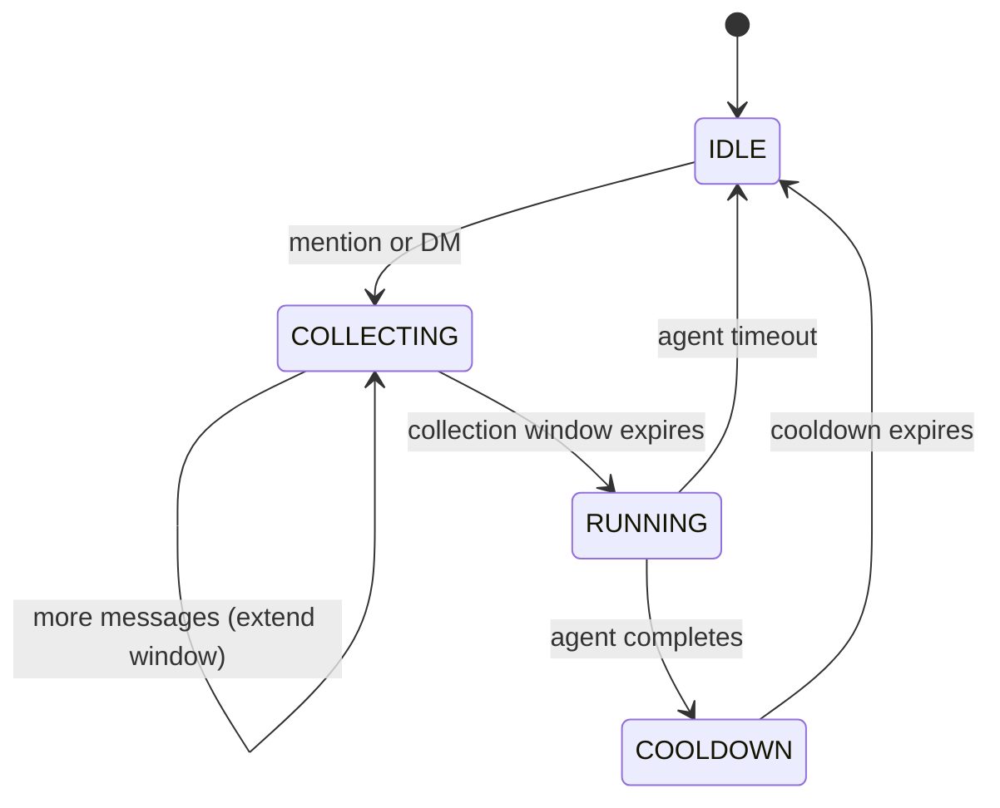
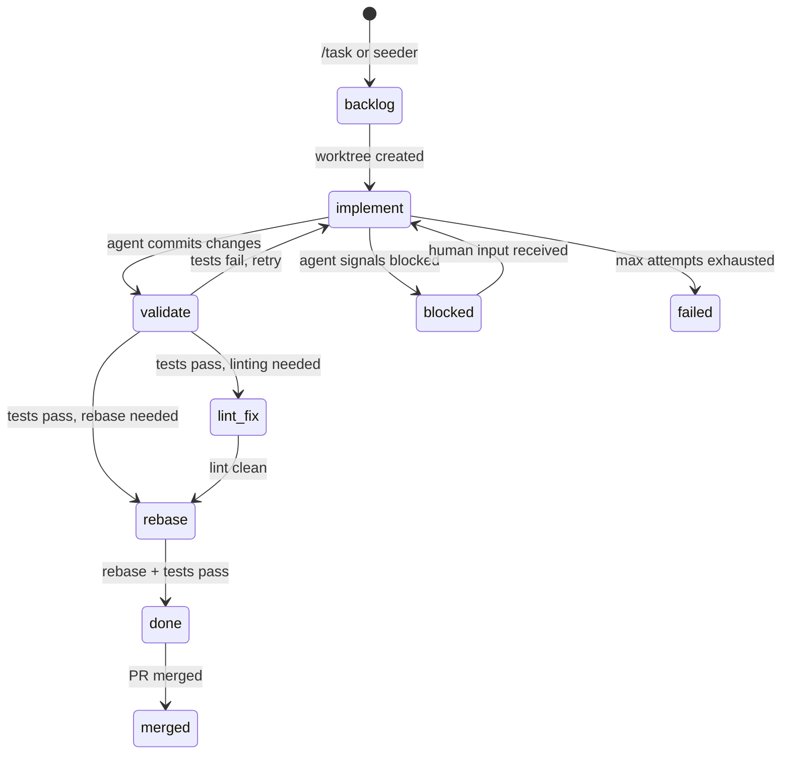

# Borg Architecture

Autonomous AI agent orchestrator written in Rust. Chat messages trigger Claude Code subprocesses. The engineering pipeline runs agents in Docker containers with git worktree isolation.

## Project Structure

```
borg-rs/
  crates/
    borg-core/     # Pipeline engine, DB, config, agent traits, modes, sidecar, observer
    borg-agent/    # Claude + Ollama agent backends
    borg-server/   # Axum HTTP server, API routes, SSE streaming, logging
    borg-domains/  # Domain-specific pipeline logic
dashboard/         # React + Vite + Tailwind web dashboard
sidecar/           # Unified Discord + WhatsApp bridge (bun, discord.js + Baileys)
container/         # Docker agent image (bun + claude CLI)
```

## System Overview


```mermaid
graph TB
    subgraph Messaging
        TG[Telegram Bot API]
        SC[Sidecar<br/>Discord + WhatsApp]
        WEB[Web Dashboard]
    end

    subgraph "borg-server (Rust/Axum)"
        HTTP[HTTP API + SSE]
        CHAT[Chat Handler]
        OBS[Observer]
    end

    subgraph "borg-core"
        SM[Per-Group State Machine<br/>IDLE→COLLECTING→RUNNING→COOLDOWN]
        PL[Pipeline Engine]
        DB[(SQLite WAL)]
    end

    subgraph "Agents"
        CA[Claude agent<br/>subprocess]
        DC[Docker container<br/>pipeline agent]
    end

    TG -->|long-poll| CHAT
    SC -->|NDJSON stdin/stdout| CHAT
    WEB -->|POST /api/chat| HTTP
    HTTP --> CHAT
    CHAT --> SM
    SM --> CA
    PL --> DC
    PL --> CA
    CHAT --> DB
    PL --> DB
    HTTP --> DB
```

## Chat Agent Flow

### Per-Group State Machine


```mermaid
stateDiagram-v2
    [*] --> IDLE
    IDLE --> COLLECTING : mention or DM
    COLLECTING --> COLLECTING : more messages (extend window)
    COLLECTING --> RUNNING : collection window expires
    RUNNING --> COOLDOWN : agent completes
    RUNNING --> IDLE : agent timeout
    COOLDOWN --> IDLE : cooldown expires
```

Messages arriving during `RUNNING` are stored in DB and included in the next invocation.

### Session Continuity

Chat session dirs live at `store/sessions/chat-{key}/`. Claude Code is invoked with `--resume <session_id>` so conversations persist across messages.

## Pipeline Flow

### Task Lifecycle


```mermaid
stateDiagram-v2
    [*] --> backlog : /task or seeder

    backlog --> implement : worktree created
    implement --> validate : agent commits changes
    validate --> lint_fix : tests pass, linting needed
    validate --> rebase : tests pass, rebase needed
    validate --> implement : tests fail, retry
    lint_fix --> rebase : lint clean
    rebase --> done : rebase + tests pass
    done --> merged : PR merged

    implement --> blocked : agent signals blocked
    blocked --> implement : human input received
    implement --> failed : max attempts exhausted
```

Phase statuses: `backlog`, `implement`, `validate`, `lint_fix`, `rebase`, `done`, `merged`, `blocked`, `failed`.

### Pipeline Phases

A single agent drives the full creative workflow (explore, test, implement). The pipeline then validates independently (runs tests), handles mechanical steps (lint, rebase, merge).

Agents can signal:
- `blocked` — pauses task, waits for human input
- `abandon` — marks failed without retrying

After 3 failed retries, sessions reset fresh with a summary of what was tried.

### Session Persistence

Per-task session dirs at `store/sessions/task-{id}/` are bind-mounted into Docker containers so agents resume across retries.

### Per-Repo Configuration

Pipeline agents receive repo-specific context via `.borg/prompt.md` or explicit `prompt_file` in `WATCHED_REPOS`.

### Self-Update

Pipeline detects merges to main on the primary repo, rebuilds (`cargo build --release`), and restarts via `execve`.

## Sidecar (Discord + WhatsApp)

Discord and WhatsApp run in a single bun process (`sidecar/bridge.js`) via multiplexed NDJSON over stdin/stdout. The Rust process spawns the sidecar and communicates via stdio.

## Observability

- `TaskStreamManager` (`borg-core/src/stream.rs`): per-task NDJSON broadcast + history buffer
- Pipeline wires `stream_tx` into `PhaseContext`; agent backends forward each stdout line in real-time
- `/api/tasks/:id/stream` serves raw Claude NDJSON (history replay + live)
- `/api/logs` replays a ring buffer to new clients then streams live via SSE
- `/api/events` queryable endpoint (category/level/since/limit filters)

## Database Schema (key tables)

| Table | Purpose |
|-------|---------|
| `pipeline_tasks` | Tasks with status, attempts, session_id, mode |
| `task_outputs` | Per-phase agent output + raw NDJSON stream |
| `pipeline_events` | Append-only structured event log |
| `repos` | Watched repos with test_cmd, auto_merge, prompt_file |
| `messages` | Chat message history |
| `sessions` | Claude session IDs per chat group/folder |
| `projects` | Document workspaces with uploaded files |
| `events` | Legacy unstructured log (still read by `/api/logs`) |

## Configuration

Key environment variables (full list in CLAUDE.md):

| Variable | Description |
|----------|-------------|
| `PIPELINE_REPO` | Primary repo path |
| `PIPELINE_TEST_CMD` | Test command for primary repo |
| `PIPELINE_AUTO_MERGE` | Auto-merge PRs (`true`/`false`) |
| `WATCHED_REPOS` | Additional repos (`path:test_cmd[:prompt_file[:mode[:lint_cmd]]]`). Append `!manual` to `test_cmd` to disable auto-merge. |
| `CONTINUOUS_MODE` | Auto-seed tasks when pipeline is idle |
| `DISCORD_TOKEN` | Discord bot token |
| `WA_AUTH_DIR` | WhatsApp auth directory |
| `WEB_BIND` | Dashboard bind address (default `127.0.0.1`) |
